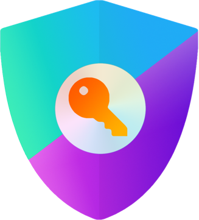

<picture>
  <source media="(prefers-reduced-motion: reduce) and (max-width: 600px)" srcset=".github/assets/terminal-mobile.svg">
  <source media="(prefers-reduced-motion: reduce)" srcset=".github/assets/terminal-header.svg">
  <source media="(max-width: 600px)" srcset=".github/assets/terminal-mobile.gif">
  
</picture>

<h1 align="center">Hi, I'm Muhammad Yousaf</h1>

<p align="center">
  <picture>
    <source media="(prefers-reduced-motion: reduce)" srcset=".github/assets/typing-intro-static.png">
    
  </picture>
</p>

<p align="center">
  <strong>Full-Stack + AI Systems Engineer</strong><br>
  Building web applications, AI agents, and retrieval systems with clear paths from context to action.
</p>

<p align="center">
  <a href="https://github.com/Yosf96633/Autohunt">AutoHunt</a> &nbsp; / &nbsp;
  <a href="https://github.com/Yosf96633/DocsAI">DocsAI</a> &nbsp; / &nbsp;
  <a href="https://yousaf-dev18.vercel.app/">Portfolio</a> &nbsp; / &nbsp;
  <a href="https://linkedin.com/in/yousaf-dev18/">LinkedIn</a> &nbsp; / &nbsp;
  <a href="mailto:yousaf.dev18@gmail.com">Email</a>
</p>

## `$ whoami`

I work across **React and Next.js interfaces**, **TypeScript and Python backends**, and **AI workflows built with LangGraph**. My projects connect model reasoning to practical tools: searching documents, matching jobs, drafting responses, and automating browser tasks.

I care about the details that make those systems useful: source citations, validated outputs, persistent state, and human review before an agent submits an application.

```toml
# ~/.config/yousaf/profile.toml
shell = "zsh"
editor = "VS Code"
focus = ["Full-stack development", "AI agents", "RAG"]
approach = ["Typed interfaces", "Traceable answers", "Human review"]
```

## `$ ls ~/projects`

### [AutoHunt](https://github.com/Yosf96633/Autohunt)

**From CV to reviewed job application, in one stateful workflow.**

`LangGraph` · `Playwright` · `Next.js` · `TypeScript` · `PostgreSQL` · `Zod`

A **10-stage agent workflow** that parses a CV, discovers jobs, scores relevance, and drafts cover letters before browser-driven submission.

- **Review before action:** users review scored jobs and cover letters before automated submission.
- **Iterative drafting:** OpenAI and Groq support job–CV matching and a cover-letter self-critique loop.
- **Persistent state:** PostgreSQL-backed LangGraph checkpoints retain workflow progress; Zod validates extracted CV data, normalized jobs, and model outputs.
- **Visible progress:** a Next.js dashboard shows live agent status, job browsing, and skill matches.

[Explore the repository →](https://github.com/Yosf96633/Autohunt)

### [DocsAI](https://github.com/Yosf96633/DocsAI)

**Ask questions about legal documents and trace answers to the source.**

`FastAPI` · `Next.js` · `LangGraph` · `Qdrant` · `Cohere` · `PostgreSQL`

A document analysis assistant with **separate ingestion and RAG chat workflows**, connecting PDF processing to streamed answers and source citations.

- **Hybrid retrieval:** Qdrant combines dense embeddings and SPLADE sparse vectors, followed by Cohere reranking for semantic and keyword relevance.
- **Source visibility:** position-aware PDF chunks retain page and estimated text coordinates for citation highlighting.
- **Streaming responses:** server-sent events deliver generated text and citations to the Next.js interface.
- **Conversation isolation:** PostgreSQL-backed thread context keeps chat histories separate.

[Explore the repository →](https://github.com/Yosf96633/DocsAI)

<details>
<summary><strong>More in ~/projects</strong></summary>

| Project | What it does |
| :--- | :--- |
| **Vidspire** | YouTube sentiment analysis platform. |
| **CamBot** | AI-powered conversational chatbot. |
| **Better Auth Starter** | Authentication implementation with OAuth and two-factor authentication. |

[Browse my repositories →](https://github.com/Yosf96633?tab=repositories)

</details>

## `$ cat ~/.config/stack.toml`

<p align="center">
  <a href="https://www.typescriptlang.org/"></a>&nbsp;
  <a href="https://www.python.org/"></a>&nbsp;
  <a href="https://developer.mozilla.org/docs/Web/JavaScript"></a>&nbsp;
  <a href="https://isocpp.org/"></a>&nbsp;
  <a href="https://www.rust-lang.org/"></a>
</p>

<p align="center">
  <a href="https://nextjs.org/"></a>&nbsp;
  <a href="https://react.dev/"></a>&nbsp;
  <a href="https://redux.js.org/"></a>&nbsp;
  <a href="https://zustand-demo.pmnd.rs/"></a>&nbsp;
  <a href="https://tailwindcss.com/"></a>&nbsp;
  <a href="https://ui.shadcn.com/"></a>
</p>

<p align="center">
  <a href="https://nestjs.com/"></a>&nbsp;
  <a href="https://fastapi.tiangolo.com/"></a>&nbsp;
  <a href="https://nodejs.org/"></a>&nbsp;
  <a href="https://expressjs.com/"></a>
</p>

<p align="center">
  <a href="https://www.postgresql.org/"></a>&nbsp;
  <a href="https://www.mongodb.com/"></a>&nbsp;
  <a href="https://redis.io/"></a>&nbsp;
  <a href="https://qdrant.tech/"></a>&nbsp;
  <a href="https://orm.drizzle.team/"></a>&nbsp;
  <a href="https://mongoosejs.com/"></a>
</p>

<p align="center">
  <a href="https://www.langchain.com/"></a>&nbsp;
  <a href="https://www.langchain.com/langgraph"></a>&nbsp;
  <a href="https://cohere.com/"></a>&nbsp;
  <a href="https://n8n.io/"></a>&nbsp;
  <a href="https://modelcontextprotocol.io/"></a>
</p>

<p align="center">
  <a href="https://www.better-auth.com/"></a>&nbsp;
  <a href="https://authjs.dev/"></a>&nbsp;
  <a href="https://jwt.io/"></a>&nbsp;
  <a href="https://zod.dev/"></a>
</p>

<p align="center">
  <a href="https://www.linux.org/"></a>&nbsp;
  <a href="https://www.docker.com/"></a>&nbsp;
  <a href="https://git-scm.com/"></a>&nbsp;
  <a href="https://vercel.com/"></a>&nbsp;
  <a href="https://render.com/"></a>&nbsp;
  <a href="https://playwright.dev/"></a>
</p>

<p align="center">
  <a href="https://nmap.org/"></a>&nbsp;
  <a href="https://www.metasploit.com/"></a>&nbsp;
  <a href="https://www.wireshark.org/"></a>&nbsp;
  <a href="https://portswigger.net/burp"></a>&nbsp;
  <a href="https://wazuh.com/"></a>&nbsp;
  <a href="https://suricata.io/"></a>&nbsp;
  <a href="https://zeek.org/"></a>
</p>

## `$ git log --author="Muhammad Yousaf"`

### `2025-10 → 2026-04` · Frontend Developer

**Mozzine Technologies**

- Developed B2B SaaS dashboard features with Next.js, TypeScript, and Tailwind CSS.
- Translated **20+ Figma designs** into responsive components with shadcn/ui, maintaining consistency across desktop and mobile.
- Integrated REST APIs with Redux and Zustand, and resolved UI bugs across browsers and dashboard modules.

### `2025-07 → 2025-09` · Full Stack Intern

**Code Expert**

- Developed a multi-vendor e-commerce platform with **2 role-based dashboards** for food and gift product modules.
- Built **15+ REST API endpoints** for orders, products, and vendor operations, with shared MongoDB schemas and validation middleware.
- Improved database query response times by **40%** using Mongoose lean queries, projections, and compound indexes.
- Implemented NextAuth.js authentication, JWT sessions, role-based access, and transactional emails through Resend.

## `$ cat ~/education`

**BS Computer Science** · Government College University Faisalabad · 2021–2025

## `$ cat ~/notes/engineering.md`

I'm going deeper into the parts that make these systems dependable:

- **Agent design:** explicit state, conditional routing, persistence, and human review.
- **Retrieval:** hybrid search, reranking, and evaluation against source documents.
- **Backend architecture:** clear boundaries, authentication, and authorization.
- **Linux fundamentals:** processes, permissions, services, and how software runs underneath the framework.

## `$ git shortlog -sn`

[Repositories](https://github.com/Yosf96633?tab=repositories) · [GitHub activity](https://github.com/Yosf96633)

<details>
<summary>Optional telemetry · GitHub stats</summary>

<p align="center">
  <picture>
    <source media="(prefers-color-scheme: dark)" srcset="https://github-profile-summary-cards.vercel.app/api/cards/stats?username=Yosf96633&amp;theme=github_dark">
    
  </picture>
</p>

</details>

---

**Let's build something useful.**

For full-stack development, AI workflows, or document retrieval projects, get in touch:

[Email](mailto:yousaf.dev18@gmail.com) · [LinkedIn](https://linkedin.com/in/yousaf-dev18/) · [Portfolio](https://yousaf-dev18.vercel.app/)

<picture>
  <source media="(prefers-reduced-motion: reduce)" srcset=".github/assets/footer.svg">
  
</picture>
