<!-- Linux Desktop / violet edition. All decorative artwork is local. -->
<a name="profile-top"></a>

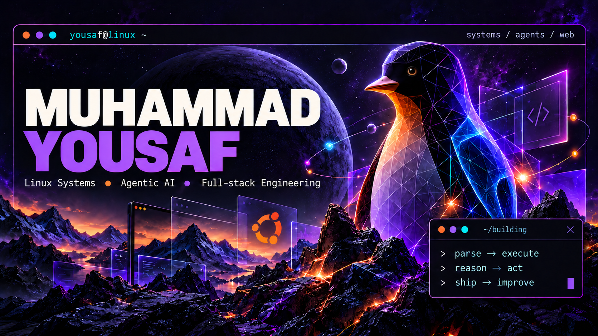

<h1 align="center">Hi, I'm Muhammad Yousaf</h1>

<p align="center">
  <strong>Linux systems · Agentic AI · Full-stack engineering</strong><br>
  From process groups and terminal control to stateful agents and cited answers.
</p>

<p align="center">
  <a href="#profile-about">About</a> &nbsp; / &nbsp;
  <a href="#profile-projects">Projects</a> &nbsp; / &nbsp;
  <a href="#profile-stack">Tech stack</a> &nbsp; / &nbsp;
  <a href="#profile-experience">Experience</a> &nbsp; / &nbsp;
  <a href="#profile-contact">Contact</a>
</p>

<p align="center">
  <a href="https://yousaf-dev18.vercel.app/">Portfolio ↗</a> &nbsp; / &nbsp;
  <a href="https://linkedin.com/in/yousaf-dev18/">LinkedIn ↗</a> &nbsp; / &nbsp;
  <a href="mailto:yousaf.dev18@gmail.com">Email ↗</a>
</p>

<picture>
  <source media="(prefers-reduced-motion: reduce) and (max-width: 600px)" srcset=".github/assets/desktop/building-mobile-static.png">
  <source media="(prefers-reduced-motion: reduce)" srcset=".github/assets/desktop/building-static.png">
  <source media="(max-width: 600px)" srcset=".github/assets/desktop/building-mobile.gif">
  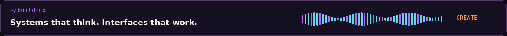
</picture>

<a name="profile-about"></a>

<h2>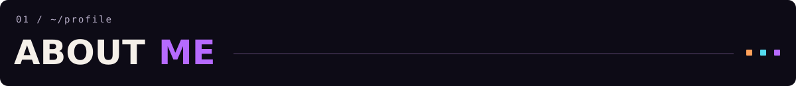</h2>

I build at the intersection of **Linux systems** and **agentic AI**. I wrote a Unix-like shell in C++20, and I build LangGraph workflows that turn model reasoning into useful actions and source-backed answers. I use TypeScript, Python, React, and Next.js to make those systems usable.

The details matter to me: process groups and terminal signals in a shell; explicit state, citations, validation, and human review in AI workflows.

<details>
<summary><strong>Inside ~/.config/yousaf/profile.toml</strong></summary>

```toml
# ~/.config/yousaf/profile.toml
shell = "zsh"
shell_project = "myShell"
editor = "VS Code"
focus = ["Linux systems", "Agentic AI", "Full-stack interfaces"]
approach = ["Process control", "Explicit state", "Traceable answers"]
```

</details>

<a name="profile-projects"></a>

<h2>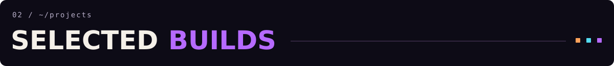</h2>

From Unix process control to AI workflows, retrieval, and full-stack applications.

<a href="https://github.com/Yosf96633/myshell">
<picture>
  <source media="(prefers-reduced-motion: reduce) and (max-width: 600px)" srcset=".github/assets/desktop/project-myshell-mobile-static.svg">
  <source media="(prefers-reduced-motion: reduce)" srcset=".github/assets/desktop/project-myshell-static.svg">
  <source media="(max-width: 600px)" srcset=".github/assets/desktop/project-myshell-mobile.svg">
  
</picture>
</a>

### [myShell](https://github.com/Yosf96633/myshell)

**A Unix-like shell built from the parser to the controlling terminal.**

<p>
  <a href="https://isocpp.org/"></a>&nbsp;
  <a href="https://www.linux.org/"></a>&nbsp;
  <a href="https://cmake.org/"></a>
</p>

A systems-programming project that implements quote-aware parsing, environment expansion, aliases, shell functions, pipelines, redirections, command history, signals, and foreground/background job control.

- **Clear execution boundary:** commands are fully parsed into `ParsedPipeline` data before execution mutates process, descriptor, or job state.
- **Unix process control:** concurrent pipeline stages share process groups, foreground jobs receive terminal signals, and `jobs`, `fg`, and `bg` manage background work.
- **Careful resource handling:** ordered redirections support file-descriptor duplication and closure, while parent-side changes are applied transactionally and restored afterward.
- **Terminal-level testing:** CTest covers parsing and exit behavior, while pseudo-terminal integration tests exercise signals, process groups, terminal handoff, and job control.

<details>
<summary><strong>Explore the implementation and architecture</strong></summary>

**Key Technical Achievements:**

- **Quote-Aware Command Parser**: Built a dedicated parser for single and double quotes backslash escaping environment assignments parameter expansion and syntax validation while correctly distinguishing quoted pipeline and background operators from shell control syntax
- **Concurrent Pipeline Execution**: Implemented multi-stage pipelines with one child process per stage shared process groups correct file-descriptor wiring and final-stage exit status propagation
- **Foreground and Background Job Control**: Added process-group based job management with terminal handoff background execution and the `jobs` `fg` and `bg` built-ins while preventing zombie processes through background reaping
- **Signal-Safe Interactive Behavior**: Coordinated `Ctrl+C` `Ctrl+\` and `Ctrl+Z` handling so signals reach foreground jobs without terminating the shell and prompt editing remains responsive
- **Transactional Redirection Engine**: Supported input output append descriptor duplication and descriptor closure with left-to-right shell semantics plus automatic restoration of parent file descriptors after built-ins complete
- **Command Resolution Cache**: Created PATH-based executable lookup with reusable path caching hit tracking invalidation when PATH changes and inspection through `hash` and `type` built-ins
- **Extensible Shell Features**: Developed a built-in registry aliases simple single-line functions recursion protection persistent environment assignments and session history with arrow-key navigation
- **Pseudo-Terminal Integration Testing**: Built automated CTest coverage for parsing execution exit statuses signals process groups terminal ownership and interactive job control using pseudo-terminals

**Technical Architecture:**

- Runtime: C++20 application using POSIX process signal file-descriptor and terminal APIs
- Parsing: Two-stage pipeline and command parser producing structured commands before execution begins
- Execution: Parent-side dispatch for stateful built-ins plus fork and exec process groups for external commands pipelines and background jobs
- Terminal Control: termios-based line editing process-group management and explicit terminal ownership handoff
- Build and Testing: CMake with compiler warnings CTest unit tests and pseudo-terminal integration tests

</details>

[Explore the repository →](https://github.com/Yosf96633/myshell)

<a href="https://github.com/Yosf96633/Autohunt">
<picture>
  <source media="(prefers-reduced-motion: reduce) and (max-width: 600px)" srcset=".github/assets/desktop/project-autohunt-mobile-static.svg">
  <source media="(prefers-reduced-motion: reduce)" srcset=".github/assets/desktop/project-autohunt-static.svg">
  <source media="(max-width: 600px)" srcset=".github/assets/desktop/project-autohunt-mobile.svg">
  
</picture>
</a>

### [AutoHunt](https://github.com/Yosf96633/Autohunt)

**From CV to reviewed job application, in one stateful workflow.**

<p>
  <a href="https://www.langchain.com/langgraph"></a>&nbsp;
  <a href="https://playwright.dev/"></a>&nbsp;
  <a href="https://nextjs.org/"></a>&nbsp;
  <a href="https://www.typescriptlang.org/"></a>&nbsp;
  <a href="https://www.postgresql.org/"></a>&nbsp;
  <a href="https://zod.dev/"></a>&nbsp;
  <a href="https://openai.com/"></a>&nbsp;
  <a href="https://groq.com/"></a>
</p>

A **10-stage agent workflow** that parses a CV, discovers jobs, scores relevance, and drafts cover letters before browser-driven submission.

- **Review before action:** users review scored jobs and cover letters before automated submission.
- **Iterative drafting:** OpenAI and Groq support job–CV matching and a cover-letter self-critique loop.
- **Persistent state:** PostgreSQL-backed LangGraph checkpoints retain workflow progress; Zod validates extracted CV data, normalized jobs, and model outputs.
- **Visible progress:** a Next.js dashboard shows live agent status, job browsing, and skill matches.

<details>
<summary><strong>Explore the implementation and architecture</strong></summary>

**Key Technical Achievements:**

- **Stateful LangGraph Workflow**: Orchestrated a complex 10-node state machine handling CV parsing job scraping relevance scoring filtering cover letter generation self-critique refinement human interruption browser automation tracking and email digest composition
- **Browser Automation Pipeline**: Built robust Playwright scripts that navigate job portals dynamically locate form fields and auto-fill applications based on structured resume data extraction
- **Multi-LLM Evaluation System**: Integrated OpenAI and Groq Llama 3.3 for dual-purpose evaluation including semantic job-CV matching with percentage scoring and iterative cover letter generation with critic-refiner loop for quality assurance
- **Document Intelligence**: Implemented pdfjs-dist based PDF parsing pipeline that extracts structured professional data from uploaded resumes including skills experience education and contact information
- **Human-in-the-Loop Architecture**: Designed graph interruption mechanism allowing users to review scored jobs and generated cover letters before automated submission combining AI efficiency with human judgment
- **Modern Full-Stack Dashboard**: Built real-time monitoring interface with Next.js 16 App Router React 19 Tailwind CSS v4 and shadcn/ui featuring live agent status job board browsing visualization skill matching analytics and application statistics
- **Type-Safe Validation**: Enforced strict schema validation throughout the workflow using Zod for CV data job listings LLM outputs and application forms ensuring data integrity across all pipeline stages
- **Database Integration**: Configured PostgreSQL with LangGraph checkpointing for workflow state persistence and SQLite for local job tracking with comprehensive application history logging

**Technical Architecture:**

- Backend: Node.js plus Express plus TypeScript with LangGraph state management
- Frontend: Next.js 16 App Router plus React 19 plus Tailwind CSS v4 plus shadcn/ui plus Framer Motion
- AI/ML: OpenAI API plus Groq Llama 3.3 plus pdfjs-dist plus semantic scoring algorithms
- Automation: Playwright for cross-platform browser automation with anti-detection measures
- Database: PostgreSQL for LangGraph checkpoints plus SQLite for job tracking

</details>

[Explore the repository →](https://github.com/Yosf96633/Autohunt)

<a href="https://github.com/Yosf96633/DocsAI">
<picture>
  <source media="(prefers-reduced-motion: reduce) and (max-width: 600px)" srcset=".github/assets/desktop/project-docsai-mobile-static.svg">
  <source media="(prefers-reduced-motion: reduce)" srcset=".github/assets/desktop/project-docsai-static.svg">
  <source media="(max-width: 600px)" srcset=".github/assets/desktop/project-docsai-mobile.svg">
  
</picture>
</a>

### [DocsAI](https://github.com/Yosf96633/DocsAI)

**Ask questions about legal documents and trace answers to the source.**

<p>
  <a href="https://www.python.org/"></a>&nbsp;
  <a href="https://fastapi.tiangolo.com/"></a>&nbsp;
  <a href="https://nextjs.org/"></a>&nbsp;
  <a href="https://www.langchain.com/langgraph"></a>&nbsp;
  <a href="https://qdrant.tech/"></a>&nbsp;
  <a href="https://cohere.com/"></a>&nbsp;
  <a href="https://www.postgresql.org/"></a>&nbsp;
  <a href="https://openai.com/"></a>&nbsp;
  <a href="https://groq.com/"></a>&nbsp;
  <a href="https://cloudinary.com/"></a>
</p>

A document analysis assistant with **separate ingestion and RAG chat workflows**, connecting PDF processing to streamed answers and source citations.

- **Hybrid retrieval:** Qdrant combines dense embeddings and SPLADE sparse vectors, followed by Cohere reranking for semantic and keyword relevance.
- **Source visibility:** position-aware PDF chunks retain page and estimated text coordinates for citation highlighting.
- **Streaming responses:** server-sent events deliver generated text and citations to the Next.js interface.
- **Conversation isolation:** PostgreSQL-backed thread context keeps chat histories separate.

<details>
<summary><strong>Explore the implementation and architecture</strong></summary>

**Key Technical Achievements:**

- **Legal Document Validation Pipeline**: Built an AI-powered pre-check system using GPT-4o-mini that analyzes uploaded PDFs to confirm they contain legal or compliance content before processing begins preventing wasted resources on irrelevant files
- **Hybrid Search Retrieval**: Implemented dual-vector search combining dense embeddings from OpenAI and sparse SPLADE vectors in Qdrant to capture both semantic meaning and exact keyword matches in legal terminology
- **Cohere Reranking Integration**: Added a reranking step after initial retrieval to sort results by true relevance ensuring only the most pertinent document sections inform the final answer
- **Streaming Response Architecture**: Developed server-sent events endpoint that delivers AI-generated tokens and citation sources in real time creating a responsive chat experience without page reloads
- **Multi-Provider LLM Orchestration**: Integrated Groq Llama 3.3 for generation OpenAI for embeddings and Cohere for reranking within a single LangGraph workflow optimizing cost and performance across different task types
- **Position-Aware Chunking**: Created custom PDF parsing logic that estimates vertical position of each text chunk enabling precise citation highlighting in the frontend document viewer
- **Thread-Isolated Context Management**: Designed PostgreSQL-backed thread system ensuring chat history and document context remain completely separate per conversation maintaining privacy and accuracy

**Technical Architecture:**

- Backend: Python FastAPI with LangGraph state machine orchestration
- Frontend: Next.js 16 App Router plus React 19 plus Tailwind CSS v4 plus Radix UI components
- AI Stack: Groq Llama 3.3 for generation plus OpenAI text-embedding-3-small for vectorization plus Cohere Reranker for result refinement
- Storage: Qdrant hybrid vector database plus PostgreSQL for metadata and thread management plus Cloudinary for PDF storage
- Workflow: Two independent LangGraph pipelines handling document ingestion and chat generation separately

</details>

[Explore the repository →](https://github.com/Yosf96633/DocsAI)

<a href="https://getvidly.com/">
<picture>
  <source media="(prefers-reduced-motion: reduce) and (max-width: 600px)" srcset=".github/assets/desktop/project-vidspire-mobile-static.svg">
  <source media="(prefers-reduced-motion: reduce)" srcset=".github/assets/desktop/project-vidspire-static.svg">
  <source media="(max-width: 600px)" srcset=".github/assets/desktop/project-vidspire-mobile.svg">
  
</picture>
</a>

### [Vidspire / Vidly](https://getvidly.com/)

**YouTube sentiment analysis platform.**

<p>
  <a href="https://nodejs.org/"></a>&nbsp;
  <a href="https://expressjs.com/"></a>&nbsp;
  <a href="https://www.typescriptlang.org/"></a>&nbsp;
  <a href="https://www.langchain.com/"></a>&nbsp;
  <a href="https://www.langchain.com/langgraph"></a>&nbsp;
  <a href="https://bullmq.io/">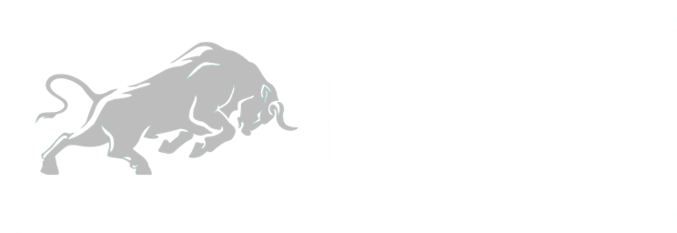</a>&nbsp;
  <a href="https://redis.io/"></a>&nbsp;
  <a href="https://socket.io/"></a>&nbsp;
  <a href="https://nextjs.org/"></a>&nbsp;
  <a href="https://resend.com/"></a>&nbsp;
  <a href="https://render.com/"></a>&nbsp;
  <a href="https://vercel.com/"></a>
</p>

An AI-powered platform that analyzes YouTube comments and transcripts to surface sentiment, emotions, content patterns, and actionable insights. Co-developed with **80% backend contribution** and **20% frontend contribution**.

- **Asynchronous processing:** BullMQ and Redis queue analysis jobs and coordinate workers, with concurrency and rate limits controlling workload.
- **Seven-stage analysis:** LangGraph runs sentiment classification and parallel analysis for emotions, patterns, loved aspects, improvements, and viewer requests.
- **Visible progress:** WebSocket updates follow each stage from queuing and data fetching through analysis and completion.
- **Resilient integrations:** parallel comment/transcript fetching, structured Zod outputs, Gemini key rotation, and Redis-backed rate limiting support processing.
- **Full-stack delivery:** deployed the backend on Render, configured Resend notifications, and contributed Next.js UI and SEO improvements on Vercel.

<details>
<summary><strong>Explore the implementation and architecture</strong></summary>

**Key Technical Achievements:**

- **Asynchronous Job Processing**: Architected queue-based system using BullMQ and Redis where sentiment analysis requests generate job IDs and are queued for processing by available workers preventing server overload and ensuring optimal resource utilization
- **LangGraph Workflow Engine**: Built multi-stage AI workflow with parallel processing pipelines featuring sentiment classification emotional analysis content pattern detection and actionable insights generation across 7 distinct stages
- **API Key Rotation & Load Balancing**: Implemented intelligent rotation across 8 Google Gemini API keys with automatic load distribution to optimize throughput and prevent rate limit bottlenecks
- **Real-time Progress Tracking**: Integrated WebSocket communication providing live progress updates through stages including queued fetching comments transcript retrieval classification parallel analysis summarization and completion
- **Parallel Data Fetching**: Optimized data retrieval using Promise.allSettled for concurrent YouTube comments and transcript fetching with graceful fallback handling
- **Redis-Based Rate Limiting**: Applied feature-specific throttling with express-rate-limit and Redis store to ensure system stability under high concurrent load
- **Production Deployment**: Configured backend deployment on Render implemented Resend for transactional email notifications and optimized Next.js frontend with SEO enhancements on Vercel with custom domain integration
- **Worker Concurrency Control**: Configured BullMQ workers with concurrency of 3 and rate limiting for optimal performance
- **Frontend Contributions**: Developed UI enhancements implemented SEO optimization in Next.js and improved overall user experience with 20% frontend contribution

**Technical Architecture:**

- Backend processes comments in batches using structured LLM outputs via Zod schemas
- Parallel analysis branches for emotions patterns loved aspects improvements and viewer requests
- Automatic transcript availability detection with non-blocking error handling
- Job progress tracking with percentage-based updates and stage-specific messages

</details>

[Live platform →](https://getvidly.com/) · [Backend →](https://github.com/Yosf96633/Vidly_backend) · [Frontend →](https://github.com/Yosf96633/Vidly_frontend)

<a href="https://github.com/Yosf96633/Better_auth_starter">
<picture>
  <source media="(prefers-reduced-motion: reduce) and (max-width: 600px)" srcset=".github/assets/desktop/project-better-auth-mobile-static.svg">
  <source media="(prefers-reduced-motion: reduce)" srcset=".github/assets/desktop/project-better-auth-static.svg">
  <source media="(max-width: 600px)" srcset=".github/assets/desktop/project-better-auth-mobile.svg">
  
</picture>
</a>

### [Better Auth Starter](https://github.com/Yosf96633/Better_auth_starter)

**Authentication implementation with OAuth and two-factor authentication.**

<p>
  <a href="https://nextjs.org/"></a>&nbsp;
  <a href="https://react.dev/"></a>&nbsp;
  <a href="https://www.typescriptlang.org/"></a>&nbsp;
  <a href="https://tailwindcss.com/"></a>&nbsp;
  <a href="https://www.better-auth.com/"></a>&nbsp;
  <a href="https://www.postgresql.org/"></a>&nbsp;
  <a href="https://orm.drizzle.team/"></a>&nbsp;
  <a href="https://zod.dev/"></a>&nbsp;
  <a href="https://resend.com/"></a>
</p>

A Next.js and Better Auth starter covering sign-in, account management, and transactional email.

- **Sign-in options:** email/password authentication and GitHub/Google OAuth, with email verification and account linking.
- **Two-factor authentication:** TOTP verification, backup codes, and session management.
- **Account workflows:** profile updates, password changes and resets, and account deletion.
- **Data and email:** PostgreSQL with Drizzle ORM, Zod validation, and Resend/React Email templates.

[Explore the repository →](https://github.com/Yosf96633/Better_auth_starter)

[Browse all repositories →](https://github.com/Yosf96633?tab=repositories)

<a name="profile-stack"></a>

<h2>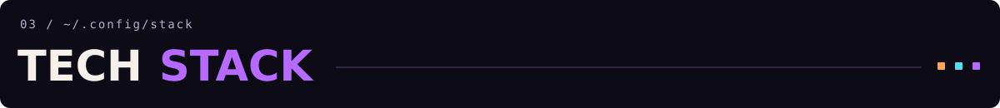</h2>

<p><picture>
  <source media="(max-width: 600px)" srcset=".github/assets/desktop/stack-languages-mobile.svg">
  
</picture></p>

<p align="center">
  <a href="https://www.typescriptlang.org/"></a>&nbsp;
  <a href="https://developer.mozilla.org/docs/Web/JavaScript"></a>&nbsp;
  <a href="https://www.python.org/"></a>&nbsp;
  <a href="https://isocpp.org/"></a>&nbsp;
  <a href="https://www.c-language.org/"></a>&nbsp;
  <a href="https://www.rust-lang.org/"></a>&nbsp;
  <a href="https://www.gnu.org/software/bash/"></a>&nbsp;
  <a href="https://www.php.net/"></a>
</p>

<p><picture>
  <source media="(max-width: 600px)" srcset=".github/assets/desktop/stack-frontend-mobile.svg">
  
</picture></p>

<p align="center">
  <a href="https://developer.mozilla.org/docs/Web/HTML"></a>&nbsp;
  <a href="https://developer.mozilla.org/docs/Web/CSS"></a>&nbsp;
  <a href="https://react.dev/"></a>&nbsp;
  <a href="https://nextjs.org/"></a>&nbsp;
  <a href="https://tailwindcss.com/"></a>&nbsp;
  <a href="https://ui.shadcn.com/"></a>&nbsp;
  <a href="https://redux.js.org/"></a>&nbsp;
  <a href="https://zustand-demo.pmnd.rs/"></a>&nbsp;
  <a href="https://playwright.dev/"></a>
</p>

<p><picture>
  <source media="(max-width: 600px)" srcset=".github/assets/desktop/stack-backend-mobile.svg">
  
</picture></p>

<p align="center">
  <a href="https://nodejs.org/"></a>&nbsp;
  <a href="https://expressjs.com/"></a>&nbsp;
  <a href="https://nestjs.com/"></a>&nbsp;
  <a href="https://fastapi.tiangolo.com/"></a>&nbsp;
  <a href="https://laravel.com/"></a>&nbsp;
  <a href="https://www.better-auth.com/"></a>&nbsp;
  <a href="https://authjs.dev/"></a>&nbsp;
  <a href="https://jwt.io/"></a>&nbsp;
  <a href="https://zod.dev/"></a>&nbsp;
  <a href="https://developer.mozilla.org/docs/Web/API/WebSockets_API"></a>&nbsp;
  <a href="https://socket.io/"></a>&nbsp;
  <a href="https://bullmq.io/"></a>&nbsp;
  <a href="https://resend.com/"></a>
</p>

<p><picture>
  <source media="(max-width: 600px)" srcset=".github/assets/desktop/stack-data-mobile.svg">
  
</picture></p>

<p align="center">
  <a href="https://www.postgresql.org/"></a>&nbsp;
  <a href="https://www.mongodb.com/"></a>&nbsp;
  <a href="https://www.mysql.com/"></a>&nbsp;
  <a href="https://redis.io/"></a>&nbsp;
  <a href="https://qdrant.tech/"></a>&nbsp;
  <a href="https://www.prisma.io/"></a>&nbsp;
  <a href="https://orm.drizzle.team/"></a>&nbsp;
  <a href="https://mongoosejs.com/"></a>&nbsp;
  <a href="https://sqlite.org/"></a>&nbsp;
  <a href="https://cloudinary.com/"></a>
</p>

<p><picture>
  <source media="(max-width: 600px)" srcset=".github/assets/desktop/stack-ai-mobile.svg">
  
</picture></p>

<p align="center">
  <a href="https://www.langchain.com/"></a>&nbsp;
  <a href="https://www.langchain.com/langgraph"></a>&nbsp;
  <a href="https://openai.com/"></a>&nbsp;
  <a href="https://groq.com/"></a>&nbsp;
  <a href="https://cohere.com/"></a>&nbsp;
  <a href="https://n8n.io/"></a>&nbsp;
  <a href="https://modelcontextprotocol.io/"></a>
</p>

<p><picture>
  <source media="(max-width: 600px)" srcset=".github/assets/desktop/stack-linux-mobile.svg">
  
</picture></p>

<p align="center">
  <a href="https://www.linux.org/"></a>&nbsp;
  <a href="https://nmap.org/">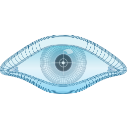</a>&nbsp;
  <a href="https://www.metasploit.com/"></a>&nbsp;
  <a href="https://www.wireshark.org/">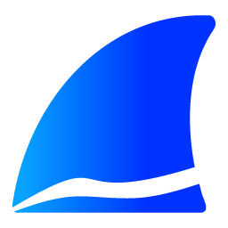</a>&nbsp;
  <a href="https://portswigger.net/burp"></a>
</p>

<p><picture>
  <source media="(max-width: 600px)" srcset=".github/assets/desktop/stack-tooling-mobile.svg">
  
</picture></p>

<p align="center">
  <a href="https://git-scm.com/"></a>&nbsp;
  <a href="https://github.com/"></a>&nbsp;
  <a href="https://cmake.org/"></a>&nbsp;
  <a href="https://www.docker.com/"></a>&nbsp;
  <a href="https://vercel.com/"></a>&nbsp;
  <a href="https://render.com/"></a>
</p>

<a name="profile-experience"></a>

<h2>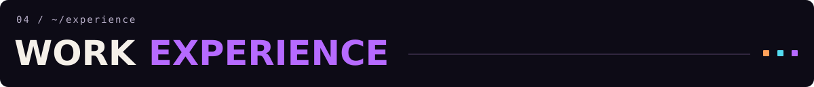</h2>

<picture>
  <source media="(max-width: 600px)" srcset=".github/assets/desktop/experience-independent-mobile.svg">
  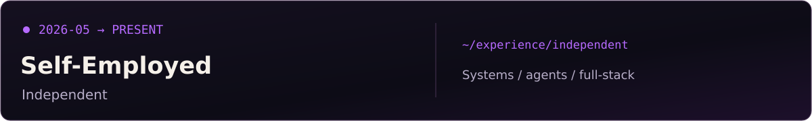
</picture>

### `2026-05 → Present` · Self-Employed

**Independent**

<picture>
  <source media="(max-width: 600px)" srcset=".github/assets/desktop/experience-mozzine-mobile.svg">
  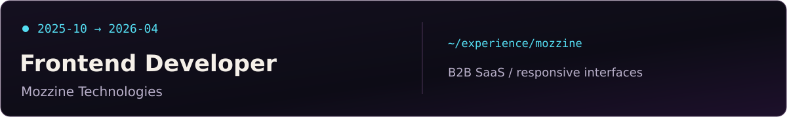
</picture>

### `2025-10 → 2026-04` · Frontend Developer

**Mozzine Technologies**

- Developed B2B SaaS dashboard features with Next.js, TypeScript, and Tailwind CSS.
- Translated **20+ Figma designs** into responsive components with shadcn/ui, maintaining consistency across desktop and mobile.
- Integrated REST APIs with Redux and Zustand, and resolved UI bugs across browsers and dashboard modules.

<p>
  <a href="https://nextjs.org/"></a>&nbsp;
  <a href="https://www.typescriptlang.org/"></a>&nbsp;
  <a href="https://tailwindcss.com/"></a>&nbsp;
  <a href="https://ui.shadcn.com/"></a>&nbsp;
  <a href="https://redux.js.org/"></a>&nbsp;
  <a href="https://zustand-demo.pmnd.rs/"></a>
</p>

<picture>
  <source media="(max-width: 600px)" srcset=".github/assets/desktop/experience-code-expert-mobile.svg">
  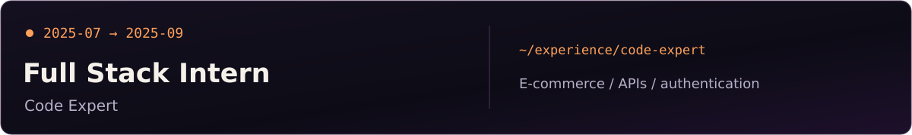
</picture>

### `2025-07 → 2025-09` · Full Stack Intern

**Code Expert**

- Developed a multi-vendor e-commerce platform with **2 role-based dashboards** for food and gift product modules.
- Built **15+ REST API endpoints** for orders, products, and vendor operations, with shared MongoDB schemas and validation middleware.
- Improved database query response times by **40%** using Mongoose lean queries, projections, and compound indexes.
- Implemented NextAuth.js authentication, JWT sessions, role-based access, and transactional emails through Resend.

<p>
  <a href="https://nextjs.org/"></a>&nbsp;
  <a href="https://expressjs.com/"></a>&nbsp;
  <a href="https://nodejs.org/"></a>&nbsp;
  <a href="https://tailwindcss.com/"></a>&nbsp;
  <a href="https://www.mongodb.com/"></a>&nbsp;
  <a href="https://mongoosejs.com/"></a>&nbsp;
  <a href="https://authjs.dev/"></a>&nbsp;
  <a href="https://jwt.io/"></a>&nbsp;
  <a href="https://resend.com/"></a>
</p>

<picture>
  <source media="(max-width: 600px)" srcset=".github/assets/desktop/experience-hiba-logics-mobile.svg">
  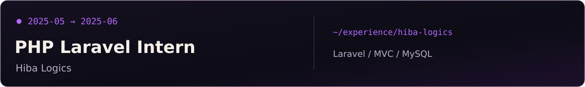
</picture>

### `2025-05 → 2025-06` · PHP Laravel Intern

**Hiba Logics**

- Applied Laravel routing, controllers, Eloquent ORM, and Blade templates in backend development.
- Built server-side logic and database interactions using the Model–View–Controller pattern.
- Worked with MySQL queries, migrations, and Laravel's schema builder.
- Collaborated with senior developers, participated in code reviews, and followed team development practices.

<p>
  <a href="https://www.php.net/"></a>&nbsp;
  <a href="https://laravel.com/"></a>&nbsp;
  <a href="https://www.mysql.com/"></a>&nbsp;
  <a href="https://git-scm.com/"></a>
</p>

<a name="profile-education"></a>

<h2>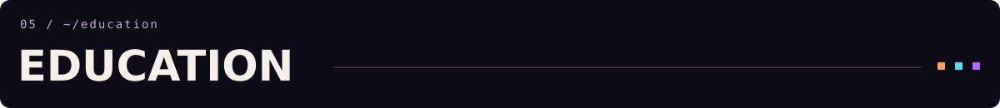</h2>

**BS Computer Science** · Government College University Faisalabad · 2021–2025

<a name="profile-notes"></a>

<h2>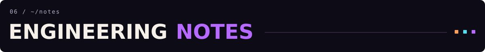</h2>

I'm going deeper into the parts that make these systems dependable:

- **Agent design:** explicit state, conditional routing, persistence, and human review.
- **Retrieval:** hybrid search, reranking, and evaluation against source documents.
- **Backend architecture:** clear boundaries, authentication, and authorization.
- **Linux fundamentals:** processes, permissions, services, and how software runs underneath the framework.

<a name="profile-activity"></a>

<h2>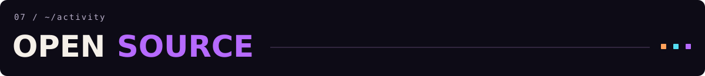</h2>

[Repositories](https://github.com/Yosf96633?tab=repositories) · [GitHub activity](https://github.com/Yosf96633)

<details>
<summary>Optional telemetry · GitHub stats</summary>

<p align="center">
  <picture>
    <source media="(prefers-color-scheme: dark)" srcset="https://github-profile-summary-cards.vercel.app/api/cards/stats?username=Yosf96633&amp;theme=github_dark">
    
  </picture>
</p>

</details>

<a name="profile-contact"></a>

<h2>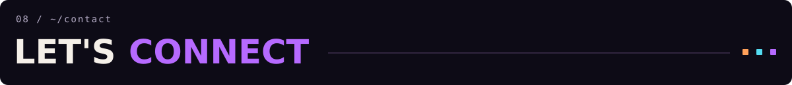</h2>

**Let's build something useful.**

For Linux systems, agentic AI, or full-stack projects, get in touch:

<p align="center">
  <a href="https://yousaf-dev18.vercel.app/"></a>
  <a href="https://linkedin.com/in/yousaf-dev18/"></a>
  <a href="mailto:yousaf.dev18@gmail.com"></a>
</p>

[Email](mailto:yousaf.dev18@gmail.com) · [LinkedIn](https://linkedin.com/in/yousaf-dev18/) · [Portfolio](https://yousaf-dev18.vercel.app/) · [Back to top ↑](#profile-top)
